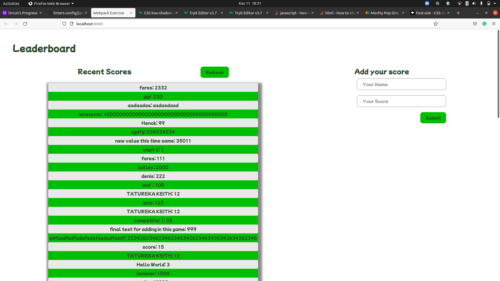

# Leader Board

> A JavaScript project for the Leaderboard, built by using webpack and ES6 features.The website allow to submit and display scores from users. Data is preserved by using REST API.

## Built With

- JavaScript, HTML&CSS
- Webpack

## Live Demo

[Live Demo Link](https://luftedar.github.io/leaderboard/dist)

## Getting Started

To get a local copy up and running follow these simple example steps.

Open the terminal

Get the clone of the project by:

> git clone git@github.com:luftedar/leaderboard.git

Cd into the file by:

> cd leaderboard

Run following command for installing webpack:

> npm install

Run following for starting local host on your computer:

> npm start

### Prerequisites

- Web browser,
- npm,

## Authors

👤 **Author1**

- GitHub: [Luftedar](https://github.com/luftedar)
- Twitter: [OrcunUgur2](https://twitter.com/OrcunUgur2)
- LinkedIn: [LinkedIn](https://www.linkedin.com/in/orcunugur)

## 🤝 Contributing

Contributions, issues, and feature requests are welcome!

Feel free to check the [issues page](../../issues/).

## Show your support

Give a ⭐️ if you like this project!

## Acknowledgments

- This project built for the Microverse's Module Two Week Four.

## 📝 License

This project is [MIT](./MIT.md) licensed.
